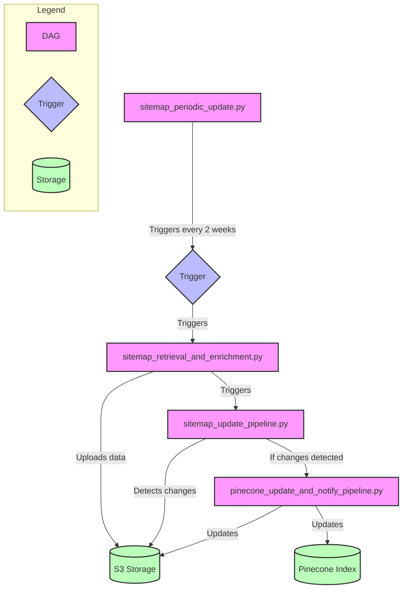

# HUBer: Data Management Pipeline

This repository is the data management component of the HUBer Project. It contains an Airflow-based pipeline for web scraping, data processing, and storage management, developed as part of a master's thesis research project at Humboldt University of Berlin. The pipeline is designed to periodically retrieve and process website content, maintaining an up-to-date knowledge base for a chatbot system without the need for manual intervention.

## Project Structure

The project consists of four main Directed Acyclic Graphs (DAGs) and several custom operators:

**DAGs**:
* `sitemap_retrieval_and_enrichment.py`: Retrieves sitemap data, processes it, and enriches it with additional information.
* `sitemap_periodic_update.py`: Periodically updates the sitemap data and triggers the update pipeline.
* `sitemap_update_pipeline.py`: Compares current and previous versions of sitemap data, detects changes, and triggers updates.
* `pinecone_update_and_notify_pipeline.py`: Updates Pinecone index and S3 storage based on sitemap changes and sends notifications.

**Custom Operators**:
* `content_extractor.py`
* `download_funcs.py`
* `pinecone_func.py`
* `pinecone_uploader.py`
* `shared_utils.py`
* `sitemap_processor.py`
* `unpack_funcs.py`
* `web_utils.py`

## Setup and Execution

### Prerequisites

* Docker
* Docker Compose
* AWS:
    * Please, create an account and get your AWS credentials.
    * For the local setup, you can use the `aws configure` command to set up your credentials.
    * For the Airflow setup, you need to have the `s3_access_key` and `s3_secret_key` in the Airflow UI(`aws_default` in your **Connections**)
* Pinecone Account
* Telegram Account:
    * Please, create an account and get your Telegram bot token.
    * Please, create a chat with your bot and get your chat id.
    * Please, configure TELEGRAM_BOT_TOKEN and TELEGRAM_CHAT_ID in the Airflow UI under **Variables**.


### Setup

1. Clone the repository:
   ```bash
   git clone https://github.com/sonyaarom/huber_airflow_dm.git
   ```

2. Navigate to the project directory:
   ```bash
   cd huber-data-management
   ```

3. Create a `.env` file and add necessary environment variables, such as your AWS credentials and Pinecone API key. Create folders: dags/, plugins/, logs/, and config/ in your repository before running the next steps.


4. Build the Docker image:
    ```bash
    docker compose build --no-cache
    ```

5. Start the Airflow services:
    ```bash
    docker compose up -d
    ```

6. Access the Airflow UI at `http://localhost:8080`. Default username and password are `airflow` and `airflow`.

7. Please, manually run the DAG: `sitemap_retrieval_and_enrichment.py`. This DAG is created for the initial data collection. 

8.The `sitemap_periodic_update` DAG will run automatically every two weeks. Other DAGs can be triggered manually or will be triggered based on the pipeline logic.


## Logic of the DAGs


1. `sitemap_periodic_update.py` is set to trigger every two weeks.
2. When triggered, it initiates the `sitemap_retrieval_and_enrichment.py` DAG.
3. `sitemap_retrieval_and_enrichment.py` processes the sitemap data and uploads it to S3 storage.
4. It then triggers the `sitemap_update_pipeline.py` DAG.
5. `sitemap_update_pipeline.py` checks for changes in the S3 storage.
6. If changes are detected, it triggers the `pinecone_update_and_notify_pipeline.py` DAG.
7. `pinecone_update_and_notify_pipeline.py` updates both the S3 storage and the Pinecone index with the new data.

## Dependencies

* Apache Airflow
* Pandas
* Pinecone
* SentenceTransformers
* Amazon S3

For the full list of dependencies, please, check the `requirements.txt` file.

## Contributing

This project is a part of a master's thesis research project at Humboldt University of Berlin.
For questions, suggestions, or contributions, please, contact the repository owner.

## License

This project is licensed under the MIT License.

